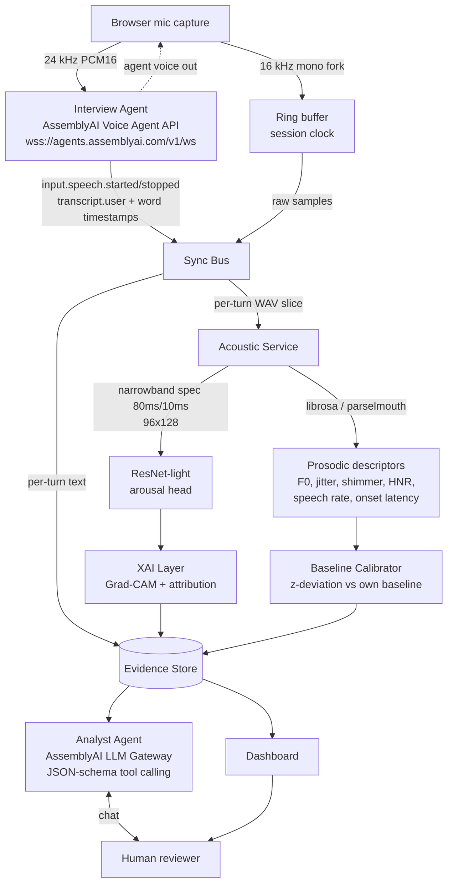

# Architecture — Vocal Stress Co-Pilot for Structured Interviews

> **Working name:** `Baseline` — the product's core mechanic is measuring deviation from
> *each speaker's own* vocal baseline, not from a population average.

**Hackathon:** Build Voice AI Agents on AssemblyAI (lablab.ai × AssemblyAI), Sep 1–30 2026.

**Companion documents:** [ADR.md](ADR.md) records *why* each decision below was taken and
what it costs (plus a catalogue of every bug that reached running code, and its guard).
[SKILLS.md](SKILLS.md) covers *how to work* on the codebase.

---

## 1. What this system is (and is not)

**It is:** a real-time voice agent that conducts a structured interview while a parallel
acoustic pipeline measures *vocal stress/arousal deviation* per answer, and a second agent
explains those measurements conversationally to a human reviewer.

**It is not:** a lie detector. No component of this system outputs a determination of
truthfulness. Voice-based deception detection is scientifically contested; overclaiming it
is both dishonest and a scoring liability. Every user-facing string uses the vocabulary of
*signals*, *deviation*, and *confidence* — never *lying*, *guilty*, or *deceptive*.

This constraint is architectural, not cosmetic: it is enforced in the Analyst Agent's system
prompt, in the evidence JSON schema (`disclaimer` field), and in the UI copy.

---

## 2. Responsibility split

The design principle is **one job per component, and a single synchronization authority.**
The most common way this class of system fails is timing drift between the audio being
scored and the transcript being displayed — so segmentation is centralized in exactly one
place and everything else consumes its output.

| # | Component | Owns | Explicitly does NOT own |
|---|-----------|------|-------------------------|
| 1 | **Audio Ingest** | Capturing the mic once, fanning it out to two consumers, stamping a single session clock | Any analysis, any buffering policy beyond the ring buffer |
| 2 | **Interview Agent** (AssemblyAI Voice Agent API) | Running the conversation: VAD, turn-taking, STT, LLM, TTS, barge-in | Stress scores. It is **deliberately blind** to them |
| 3 | **Sync Bus** | The single source of truth mapping `turn_id → (audio slice, transcript, timestamps)` | Scoring, explaining, storing long-term |
| 4 | **Acoustic Service** | Narrowband spectrogram → ResNet-light → arousal score; plus interpretable prosodic descriptors | Deciding what a score *means* |
| 5 | **Baseline Calibrator** | Per-speaker feature distributions from neutral turns; converting raw features to z-deviations | Classification |
| 6 | **XAI Layer** | Grad-CAM over the spectrogram + ranked feature attribution → structured evidence | Natural language |
| 7 | **Analyst Agent** (LLM Gateway) | Explaining evidence to the reviewer in natural language, via tool calls | Producing scores, or making judgments not grounded in a tool result |
| 8 | **Dashboard** | Timeline, stress curve, Grad-CAM overlay, transcript, chat panel | Any business logic |

### Why the Interview Agent is blind to the scores

If the interviewer's behavior changes in response to a live stress reading, three things break
at once: the acoustic signal is contaminated by the agent's reaction, the interaction becomes
coercive, and the evaluation is no longer reproducible. The scores flow *sideways* into the
evidence store, never back into the conversation. This is worth saying out loud in the pitch —
it is a design decision judges can recognize as deliberate.

---

## 3. Data flow



**Note the absence of any arrow from the evidence store back into the Interview Agent.**
That gap is intentional (see §2).

---

## 4. The central data contract

Every component upstream produces, and every component downstream consumes, this object.
Building against this schema is what allows the acoustic track and the agent track to be
developed in parallel without integration pain.

```json
{
  "session_id": "s_2026_09_12_a41f",
  "turn_id": "t_007",
  "t_start_ms": 48210,
  "t_end_ms": 53880,
  "is_baseline_turn": false,

  "transcript": "I left that company because I wanted a new challenge.",
  "asr_confidence": 0.94,

  "stress": {
    "score": 0.62,
    "label": "elevated",
    "model_version": "resnet-light-arousal-v2",
    "calibrated": true
  },

  "baseline_deviation": {
    "f0_mean_z": 1.9,
    "f0_std_z": 2.4,
    "jitter_z": 0.8,
    "shimmer_z": 1.1,
    "hnr_z": -1.4,
    "speech_rate_z": -0.6,
    "onset_latency_z": 2.1
  },

  "prosody_raw": {
    "f0_mean_hz": 178.4,
    "f0_std_hz": 41.2,
    "jitter_local_pct": 1.83,
    "shimmer_local_pct": 7.94,
    "hnr_db": 11.2,
    "speech_rate_syll_s": 4.1,
    "onset_latency_ms": 1240
  },

  "xai": {
    "gradcam_png": "artifacts/s_2026_09_12_a41f/t_007_gradcam.png",
    "spectrogram_png": "artifacts/s_2026_09_12_a41f/t_007_spec.png",
    "top_contributors": [
      { "feature": "f0_std", "z": 2.4, "direction": "up" },
      { "feature": "onset_latency", "z": 2.1, "direction": "up" },
      { "feature": "f0_mean", "z": 1.9, "direction": "up" }
    ]
  },

  "disclaimer": "Vocal stress signal relative to this speaker's own baseline. Not a determination of truthfulness."
}
```

`onset_latency_ms` (silence between the question ending and the answer starting) is derived
from the Voice Agent's `input.speech.started` event minus the agent's `reply.done` timestamp —
it costs nothing to compute and is one of the more interpretable signals available.

---

## 5. Verified AssemblyAI integration points

These were confirmed against the official docs on 2026-09-04 — build against them directly,
do not re-derive.

### Interview Agent — Voice Agent API
- Endpoint: `wss://agents.assemblyai.com/v1/ws`
- Auth: API key as `Authorization: Bearer <key>` server-side; `GET /v1/token` → `?token=` for browser
- Audio: PCM16 LE **24 kHz** default (also G.711 µ-law/A-law 8 kHz), base64 chunks in JSON
- Client → server: `session.update`, `input.audio`, `tool.result`, `reply.create`, `session.end`
- Server → client: `session.ready`, `input.speech.started` / `input.speech.stopped`,
  `transcript.user.delta` / `transcript.user`, `reply.started` / `reply.audio` / `reply.done`,
  `transcript.agent`, `tool.call`, `session.error`
- Turn detection config: `session.input.turn_detection` → `vad_threshold`, `min_silence`,
  `max_silence`, `interrupt_response`

### Analyst Agent — LLM Gateway
- OpenAI-compatible API, `llm-gateway.assemblyai.com` (EU endpoint available)
- Supports multi-turn, structured outputs, and tool/function calling

### Tools exposed to the Analyst Agent (JSON Schema)

| Tool | Purpose |
|------|---------|
| `list_flagged_turns(session_id, min_score)` | Which answers deviated most |
| `get_turn_evidence(session_id, turn_id)` | Full evidence object for one turn |
| `compare_to_baseline(session_id, turn_id)` | z-deviations with the baseline window described |
| `get_transcript(session_id, range)` | Verbatim text, for grounding quotes |

The Analyst Agent's system prompt forbids asserting anything not returned by one of these
tools, and forbids the vocabulary of deception. Every claim it makes must be traceable to a
tool result — this is what makes it an *XAI interface* rather than an LLM speculating about
a person.

### Sampling-rate note
The Voice Agent path wants 24 kHz; the existing model was trained at **16 kHz**
(`TARGET_SR = 16000`). Do not resample the analysis fork from the 24 kHz stream — capture at
the device rate and produce the 16 kHz fork independently with `scipy.signal.resample_poly`
(already used in the sarcasm notebooks), so the model sees the same preprocessing it was
trained on.

---

## 6. Model track — reusing the sarcasm pipeline

The existing pipeline transfers almost verbatim. What changes is the **label**, not the
architecture.

### What is reused as-is
- `resample_poly` → 16 kHz mono normalization
- Narrowband spectrogram: 80 ms window / 10 ms hop, **3-channel encoding — not literal
  RGB**: R = log-mel (96 mel bins), G = Δ-MFCC, B = ΔΔ-MFCC, each independently
  z-scored/clipped to [0,1] (`_zscore_global`), ported verbatim from the "CÉLULA
  SUBSTITUTA SAFE" cell, including its contrast guard (raises below 3 dB dynamic range —
  the original's "tapete cinza" check)
- `build_resnet_light()` — 8→16 filters, residual blocks, SpatialDropout2D(0.25), GAP,
  BatchNorm, Dropout(0.5), softmax. **6,578 weight params** (`model.count_params()`; the
  19,384 figure from an earlier `.summary()` read included Adam's optimizer-state slots,
  which are not model weights — corrected after the actual implementation pass)
- `StratifiedGroupKFold(n_splits=5)` grouped by speaker/clip, class weights, OOF metrics
- Augmentation: gain dB, time-stretch, `noisereduce` (not yet wired into the training
  script — see Delivery plan)

### Warm start — corrected after inspecting the checkpoint directly

The original plan assumed `resnet1_prelayer1.keras` was a spectrogram-domain sarcasm
checkpoint. Loading it during implementation showed otherwise: its input shape is
**32×32×3**, matching the notebook's CIFAR-10 pretraining cell (`nomeprog =
"resnet1_prelayer1"`, `nl, nc = 32, 32`), not the 96×128 MUStARD++ spectrogram cell —
which builds a fresh model per CV fold and never calls `.save()`. **No spectrogram-domain
checkpoint exists on disk**; only this CIFAR-10-pretrained backbone does.

It is still usable: `build_resnet_light` is fully convolutional + GlobalAveragePooling,
so every weight's shape is independent of input H×W, and the checkpoint's weights load
into a 96×128 model layer-for-layer (confirmed: 33/34 layers, all but the input layer).
But the *domain* is different — natural photos vs. audio spectrograms — so the transfer
benefit is genuinely uncertain, not assumed. `scripts/train_arousal_model.py` therefore
runs both `random_init` and `warm_started` through the identical grouped-CV protocol and
keeps whichever wins on OOF F1, per §6's evaluation tiers below.

**Bug this surfaced, fixed and regression-tested**: the first version of the transplant
matched layers by name (`conv2d`, `batch_normalization_1`, ...). Keras' layer auto-naming
is a process-global counter, so the second `build_resnet_light()` call in one run
produces names like `conv2d_32` — meaning name-based matching silently transplants 0
layers from fold 2 of a k-fold loop onward while still reporting "warm-started". Fixed to
match positionally by layer type instead (`infrastructure/models/resnet_light.py`,
`load_compatible_weights`); caught by
`tests/integration/test_checkpoint_transplant.py::test_transplant_still_works_after_several_models_built_in_same_process`,
which reproduces exactly this scenario.

### What changes

| | Sarcasm model (existing) | Stress model (new) |
|---|---|---|
| Corpus | MUStARD++ | RAVDESS (`databaseAudio/audioSpeech`, 1440 files) |
| Label | `Sarcasm` 0/1 | Arousal-binarized emotion (below) |
| Grouping key | `KEY` | `Actor_XX` — **must group by actor**, or the model learns voices |
| Output framing | "sarcastic" | "elevated vocal arousal" |

### RAVDESS label mapping

RAVDESS filenames encode `modality-vocalchannel-emotion-intensity-statement-repetition-actor`.
Emotion codes: `01` neutral, `02` calm, `03` happy, `04` sad, `05` angry, `06` fearful,
`07` disgust, `08` surprised. Intensity: `01` normal, `02` strong.

Binarization for the stress head:
- **High arousal (1):** `05` angry, `06` fearful, `07` disgust, `08` surprised
- **Low arousal (0):** `01` neutral, `02` calm, `04` sad
- **Excluded:** `03` happy — high arousal but positive valence; including it teaches the model
  arousal *and* valence at once and muddies the signal. Keep it as a held-out probe set instead.

Use `audioSpeech` only. `audioSong` (1012 files) is sung — different prosodic regime, will
pollute the training distribution. Keep it as an out-of-domain robustness check if there's time.

### Evaluation — the part that makes this credible

Three tiers, in order of increasing honesty:

1. **In-corpus OOF** on RAVDESS, grouped by actor. Expect this to look good and mean little.
2. **Cross-corpus:** train on RAVDESS, test on **MUStARD++ `Arousal` column** (already labeled,
   already extracted at 16 kHz in `audio_extracted_16k/`). Acted studio speech → natural TV
   dialogue is a real domain shift. Whatever number comes out of this is the number worth
   reporting.
3. **Own recordings:** a handful of interview-style clips from consenting volunteers, used as a
   qualitative sanity check on the actual demo domain.

Report tier 2 as the headline metric. A modest, honestly-measured cross-corpus number is worth
more — to judges and to your own conclusions — than an inflated in-corpus one.

---

## 7. Baseline calibration

The first 2–3 interview questions are deliberately neutral and low-stakes ("Can you confirm your
name?", "How is your connection?"). For each prosodic feature, the calibrator accumulates
mean and standard deviation across those turns and stores them as that session's baseline.
Every later turn is reported as a z-deviation against it.

Without this the system measures *"this person has a naturally tense voice"* and produces
systematically biased output across speakers, accents, and recording conditions. With it, the
claim narrows to something defensible: *this answer deviated from how this same person sounded
five minutes ago.*

Guard: if the baseline window has fewer than ~3 usable turns or its variance is degenerate,
mark the session `calibrated: false` and have the Analyst Agent say so rather than reporting
z-scores it cannot support.

---

## 7a. Implementation status and real results

Domain layer, all dataset/audio/model infrastructure, the training and cross-corpus
evaluation services, the evidence pipeline, and both agent adapters (Voice Agent client,
LLM Gateway / Analyst Agent client) are implemented and covered by **287 passing tests**
(unit + integration against real RAVDESS/MUStARD++ audio, plus 4 quality-gate tests
below) — see SKILLS.md §6b for how to run them.

Real data confirmed: RAVDESS training subset = 1,248 clips / 24 actors (768 high-arousal,
480 low, `happy` excluded); MUStARD++ cross-corpus eval subset = 504 clips / 24 speakers
(254 low ≤5, 250 high ≥8, the 6–7 dead zone dropped — 697 rows). Feature extraction runs
end-to-end on the full data with zero failures at ~50 clips/s on this machine (CPU only,
TensorFlow 2.20, no GPU).

**The §6 A/B experiment actually ran** (`scripts/train_arousal_model.py`, grouped 5-fold
CV, CPU only):

| Variant | OOF accuracy | OOF F1 | Wall time |
|---|---|---|---|
| `random_init` | 0.688 | 0.747 | 643s |
| `warm_started` (CIFAR-10 checkpoint, 17 layers transplanted) | **0.841** | **0.875** | 519s |

The warm-started variant won clearly — a genuinely large margin (+15pp accuracy), which
was not the expected outcome given the domain gap (natural photos vs. spectrograms)
flagged when this experiment was designed. Read as: the low-level conv filters the
CIFAR-10 pretraining learned (edge/texture detectors) transfer usefully to spectrogram
texture even across that gap, at least for a network this small. It is *also* faster —
warm-started weights need less optimization to converge, hence fewer effective epochs
before early stopping.

**Cross-corpus (the number that matters — tier 2 of §6's evaluation ladder), the winning
model evaluated on MUStARD++ `Arousal`, never trained on:**

| Metric | Value |
|---|---|
| Accuracy | 0.597 |
| Precision | 0.565 |
| Recall | 0.820 |
| F1 | 0.669 |
| Majority-class baseline (this eval set) | 0.504 |

Beats the majority baseline by ~9.3pp — real signal survives the acted-studio-speech →
natural-TV-dialogue domain shift, though nowhere near the 0.841 in-corpus number, exactly
as tier 1 vs. tier 2 predicted it would degrade. The confusion matrix (`[[96,158],[45,205]]`)
shows the model over-predicts HIGH on MUStARD++ (recall 0.82, precision 0.565) — a
domain-level baseline shift: sitcom dialogue reads as more energetic than RAVDESS's
"neutral/calm" categories even when the *narrative* arousal is low. This is exactly why
§7's per-speaker baseline calibration is load-bearing in the live product rather than a
nice-to-have: the deployed system was never meant to use a fixed cross-speaker/cross-
corpus threshold — it compares a turn to that same speaker's own opening turns. This
result is the empirical case for why.

All four thresholds in `tests/quality_gates/test_minimum_accuracy_gate.py` pass on this
run. Final model: `artifacts/models/arousal_resnet_light.keras` (6,578 params), verified
loading through `KerasArousalClassifier` and producing valid Grad-CAM output on a real
held-out RAVDESS clip (99.6% confidence on a true high-arousal sample).

## 7b. Two fronts — updated after connecting for real

**Live connectivity — now confirmed** (`scripts/check_live_connection.py`, run against a
real account on 2026-09-05): both the Voice Agent API and LLM Gateway authenticate and
respond correctly. This surfaced two real protocol bugs that pure-fake testing could not
have caught, both fixed and regression-tested:

1. **`session.update`'s prompt field is `system_prompt`, not `instructions`.** The first
   implementation guessed `instructions`; the real server rejected it with
   `session.error: {"code": "invalid_format", ...}`. Fixed in
   `voice_agent_client.py::configure()`.
2. **This account's connection never emits `session.ready`.** The only event observed is
   `session.updated`, sent in response to `session.update`, with the session id nested
   at `config.id` — not a top-level `session_id` as the docs' event-type list implied.
   `VoiceAgentSession` now handles both event types; `session.updated` is what actually
   fires in practice. See the comment in `_dispatch()`.
3. **Not every model on the LLM Gateway's public roster is available to every account.**
   `claude-sonnet-5`, `claude-haiku-4-5-20251001`, and `gpt-4.1` all returned HTTP 400
   "Your account does not have access to this LLM Gateway model" on this account's $150
   free-trial tier; `qwen3.5-4b-32k-fast` works and is now the Analyst Agent's default
   (`llm_gateway_client.py::DEFAULT_MODEL`). Override via `AnalystAgent(model=...)` if
   your account has a paid plan with broader model access.

**First real live run (2026-09-05, `scripts/run_interview.py`) — one more bug found and
fixed:** connection, auth, session config, mic capture, and evidence pipeline all worked
end-to-end for real (session saved to `artifacts/sessions/*.json` with valid prosody
features and a Grad-CAM artifact). Interestingly, *both* `session.ready` and
`session.updated` fired this time (unlike `check_live_connection.py`'s bare handshake,
which only produced `session.updated`) — plausibly because a full `system_prompt` +
`tools=[]` config triggers a different path than the diagnostic script's minimal one;
both event types are handled either way, so this didn't need a fix.

What did need one: the single turn recorded was `t_start_ms: 13200` → `t_end_ms: 13300`
— **100 milliseconds**, with near-constant pitch (`f0_std_hz: 2.3`) and an empty
transcript. A real 100ms VAD trigger (mic click / room noise right after the session
opened) reached the full acoustic pipeline and got logged as a legitimate turn. Fixed by
adding `SyncBus.min_turn_duration_ms` (default 0, preserving old behavior for existing
tests; `run_interview.py` now passes 300ms) — segments shorter than the floor return
`None` from `on_speech_stopped()` instead of a `PendingTurn`, and don't consume a turn
id. Regression-tested in `tests/unit/test_sync_bus.py` (4 new tests, including one that
confirms discarded blips don't pollute the id sequence for real turns).

**Second live run (2026-09-05) — the transcript field name was right, the pairing was
wrong.** `"text"` is confirmed correct: real transcripts ("Hello?", "Can you hear me?")
came through. But turn `t0007` in the saved session had audio duration **300ms**
(`t_start_ms: 36300` → `t_end_ms: 36600`) logged against the transcript *"And I'm telling
the truth right now, I think."* — an eight-word sentence that cannot physically fit in
300ms. `transcript.user` (final) for a turn can arrive well after that turn's
`input.speech.stopped`, sometimes not until the next turn's audio has already ended;
grabbing "the most recent transcript text seen" at `speech.stopped` time silently
attached the wrong turn's words to each other, one turn late.

Fixed with `application/transcript_pairing.py`'s `TranscriptPairer` — a small FIFO queue
(turn finalization waits for its matching transcript instead of guessing) with a
self-healing overflow (`max_pending=2`: if an older turn's transcript never arrives,
e.g. wordless audio, it flushes with an empty transcript instead of blocking every
pairing after it forever) and a `flush_all()` drain at session end so the last turn(s)
of a conversation don't silently vanish if the session ends before their transcript
arrives. 6 new unit tests, including one that reproduces the exact `t0007` scenario
(a transcript arriving only after a *later* turn's audio already finished).

**Turn fragmentation, now fixed**: the Voice Agent's turn detection fragmented
continuous speech into several short turns in early live runs (e.g. "I" / "I think." /
"gonna lie now." / "I think I'm gonna lie." across four consecutive turns).
`VoiceAgentSession.configure()`'s defaults for `min_silence_ms`/`max_silence_ms` were
500ms/2000ms — guessed, not sourced — while the live docs state the platform's own
defaults as 1000ms/3000ms. Corrected to match; a 500ms pause is well within normal
mid-sentence hesitation for many speakers, so the shorter guessed default was plausibly
causing the fragmentation directly.

**Third live run (2026-09-05) — session ending after a single turn with zero
diagnostic output.** Two real visibility gaps, both fixed:
1. `"session.ended"` is a documented server→client event
   (`session.error/ended: Error and teardown events`) that `VoiceAgentSession._dispatch`
   never had an entry for — it was silently dropped. Added `on_session_ended` (mirrors
   `on_session_ready`/`on_session_updated`); regression-tested.
2. `websockets.exceptions.ConnectionClosed` is confirmed **not** a subclass of Python's
   built-in `ConnectionError` (checked via its actual MRO) — the `except
   (ConnectionError, KeyboardInterrupt, asyncio.CancelledError)` clause in
   `run_interview.py` never caught a real server-initiated disconnect. Added an explicit
   `except websockets.exceptions.ConnectionClosed as e` branch that prints `e.code` /
   `e.reason` — the server's actual stated close cause — before falling through to the
   existing cleanup.

Root cause of *why* the server closed the connection after one turn is still open —
docs mention a server-side `max_session_duration_seconds` with no documented default for
trial accounts, which is the leading hypothesis, but this pass fixed the *visibility*
gap, not yet the *cause*: the next live run's `[session ended by server]` or
`[connection closed]` log line is what will actually answer it.

**Still not run**: a full live interview with real microphone audio flowing through
`scripts/run_interview.py` end-to-end (mic → Voice Agent → SyncBus → EvidenceService →
saved session) — connectivity and protocol *shape* are now confirmed, but the live
interleaving of `transcript.user` and `input.speech.stopped` during an actual multi-turn
conversation has not been observed, since that requires a real spoken conversation, which
isn't something drivable from a non-interactive tool call. The remaining
`# ASSUMPTION:` comments in `run_interview.py` mark exactly that boundary — run it for
real and treat any surprise there the same way the two bugs above were found: fix, add a
regression test, document.

**Live capture, browser path (ADR-041, `web/live_capture.py` + `capture.html`) — now
CONFIRMED live (2026-09-06).** Before the first real session, everything up to the
actual audio hardware was tested only indirectly: the WebSocket relay's framing against
a scripted fake AssemblyAI transport (`tests/unit/test_live_capture.py`), the
AudioWorklet's resampling math by static contract only (`node --check` confirms it
parses, not that it sounds correct), the runner's turn-finalization logic directly
(`tests/unit/test_live_interview_runner.py`). The first real browser session — real mic,
real AssemblyAI connection, real speaker output, all together — surfaced two real bugs,
both fixed the same day:

1. **A freeze after ~3 exchanges.** `reply.audio`'s payload key had been guessed as
   `"audio"` by symmetry with `input.audio`; every real event missed it, so every chunk
   hit a fallback that dumped the entire raw event — a multi-kilobyte base64 blob — as
   one status line, appended as an uncapped DOM node. Fixed by trying several candidate
   keys and making the no-match diagnostic report field names/shapes only, never values
   (ADR-043); confirmed fixed — voice now plays back audibly, including loud/clear
   speech, in a real session.
2. **A false "session saved" report.** Ending a session within milliseconds of it
   starting could skip the save entirely while the endpoint still reported success —
   found by literally doing that on the first live connection. Fixed by widening the
   `finally` that flushes and saves to cover the method's whole body, not just its event
   loop, plus a second check that verifies the file actually exists before claiming so
   (ADR-042).

What's still open: this has run successfully in a handful of sessions from one
developer's machine, not from an independent user, and not across the range of
browsers/microphones a real deployment would encounter. Treat the next unfamiliar
environment the same way every "first live run" in this document was treated.

**Dashboard (`web/`)** — implemented AND tested live. `scripts/build_demo_session.py`
runs the real trained model over real RAVDESS audio (Actor_01, a mix of calm/angry/
fearful/surprised clips scripted as interview answers, clearly marked
`is_synthetic_demo: true` and never presented as a real call) to produce a real session
file. `web/backend.py` was run with `uvicorn` and hit with real `curl` requests: session
list, session detail, both Grad-CAM and spectrogram PNGs served correctly, and the chat
endpoint correctly returns 503 with a clear message when no API key is configured — the
one thing the dashboard *can't* do without a key is talk to the Analyst Agent, and it
says so instead of failing opaquely. The chat endpoint's full tool-calling round trip
(question → `tool.call` → grounded evidence → answer) is verified with
`httpx.MockTransport` in `tests/unit/test_web_backend.py`, exercising the exact same
`AnalystAgent`/`build_tool_handlers` code the live path uses.

**287 tests pass** (unit + integration + quality gates) as of this implementation pass.
To view the dashboard: `python -m uvicorn web.backend:app --reload` (from the repo root,
package installed via `pip install -e .`), then open `http://localhost:8000`.

## 8. Repository layout

As actually implemented (DDD-flavored: `domain/` has zero infrastructure dependencies;
`application/` depends only on `domain.ports`; `infrastructure/` implements those ports;
`scripts/` are composition roots that wire concrete adapters in):

```
AssemblyAi/
├── ARCHITECTURE.md
├── SKILLS.md
├── README.md                     # public submission (English, written last)
├── .gitignore                    # datasets + weights NEVER committed
├── .env.example                  # ASSEMBLYAI_API_KEY=
├── pyproject.toml / requirements.txt
│
├── src/voicestress/
│   ├── config.py                          # env-based settings, no I/O beyond os.environ
│   ├── domain/
│   │   ├── value_objects.py               # ArousalLabel, ProsodyFeatures, BaselineProfile,
│   │   │                                   # ArousalPrediction, FeatureAttribution — frozen,
│   │   │                                   # zero framework deps
│   │   ├── entities.py                    # TurnEvidence, InterviewSession (mutable aggregates)
│   │   └── ports.py                       # SpectrogramExtractorPort, ProsodyExtractorPort,
│   │                                       # ArousalClassifierPort, ExplainerPort, AudioLoaderPort
│   ├── application/
│   │   ├── training_service.py            # grouped CV use-case (TrainingConfig, run_cross_validation)
│   │   ├── cross_corpus_eval_service.py    # RAVDESS-trained model → MUStARD++ Arousal
│   │   ├── baseline_service.py             # BaselineCalibrator (accumulate → BaselineProfile)
│   │   ├── evidence_service.py             # audio+transcript → TurnEvidence, wires all ports
│   │   └── sync_bus.py                     # turn segmentation from speech.started/stopped events
│   └── infrastructure/
│       ├── audio/
│       │   ├── resampling.py              # 16kHz normalization, silence/duration guards
│       │   ├── spectrogram.py             # NarrowbandSpectrogramExtractor (R=log-mel/G=Δmfcc/B=ΔΔmfcc)
│       │   └── prosody.py                 # PraatProsodyExtractor (parselmouth: F0/jitter/shimmer/HNR)
│       ├── datasets/
│       │   ├── ravdess_catalog.py         # filename parsing, manifest, arousal binarization
│       │   └── mustard_catalog.py         # CSV loader, dead-zone binarization for cross-corpus
│       ├── models/
│       │   ├── resnet_light.py            # build_resnet_light, load_compatible_weights
│       │   ├── keras_arousal_classifier.py# ArousalClassifierPort adapter
│       │   └── gradcam.py                 # GradCAMExplainer (ExplainerPort adapter)
│       └── agents/
│           ├── voice_agent_client.py      # Voice Agent API protocol (Transport-injected, fake-tested)
│           ├── websocket_transport.py     # real `websockets`-backed Transport (echo-server tested)
│           ├── llm_gateway_client.py      # Analyst Agent / LLM Gateway adapter (httpx-injected)
│           └── tool_definitions.py        # JSON-Schema tool specs + InterviewSession-bound handlers
│
├── agents/prompts/
│   ├── interviewer.md            # Interview Agent system prompt — blind to scores by construction
│   └── analyst.md                # Analyst Agent system prompt — vocabulary + grounding rules
│
├── scripts/                      # composition roots
│   ├── build_features.py         # manifest → cached spectrogram arrays (.npz)
│   ├── train_arousal_model.py    # A/B CV (random_init vs warm_started) → final model →
│   │                              # cross-corpus eval → artifacts/metrics/latest.json
│   ├── build_demo_session.py     # real model + real audio → artifacts/sessions/*.json (no API key needed)
│   └── run_interview.py          # LIVE composition root, real mic — needs ASSEMBLYAI_API_KEY (§7b)
│
├── src/voicestress/application/
│   └── live_interview_runner.py  # LiveInterviewRunner, audio-source-agnostic (ADR-041) — shared by
│                                  # run_interview.py (MicAudioSource) and web/live_capture.py
│                                  # (WebSocketAudioSource); neither composition root duplicates the
│                                  # other's ~15 documented bug fixes (Appendix A rows 8-31)
│
├── web/
│   ├── backend.py                 # FastAPI: session list/detail, turn artifacts, Analyst Agent chat,
│   │                               # and the /ws/interview route (hands off to live_capture.py)
│   ├── live_capture.py            # browser capture composition root (ADR-041) — LIVE, needs
│   │                               # ASSEMBLYAI_API_KEY + a real browser mic; framing/relay layer is
│   │                               # tested against a fake AssemblyAI transport, no live key needed
│   └── static/                    # index.html/app.js (dashboard) + capture.html/capture.js/
│                                   # capture-worklet.js (live capture) — no build step
│
├── tests/
│   ├── unit/                     # domain + infra logic, no real audio required (includes web backend)
│   ├── integration/               # real RAVDESS/MUStARD++ audio, real checkpoint transplant
│   └── quality_gates/            # reads artifacts/metrics/latest.json, enforces §6 thresholds
│
└── artifacts/                    # gitignored — manifests, spectrogram caches, models, metrics, sessions
```

### `.gitignore` — non-negotiable entries

```gitignore
databaseAudio/
artifacts/
*.wav
*.keras
*.h5
*.png
.env
```

RAVDESS is CC BY-NC-SA 4.0 and MUStARD++ carries its own academic terms. Publishing code is
fine; publishing their audio, derived spectrogram images, or weights trained on them is what
creates an actual redistribution claim. Cite RAVDESS via its Zenodo record in the README.

---

## 9. Delivery plan (Sep 4 → Sep 30)

Submission deadline is **Sep 30, 12:00 BRT**. Plan to submit **Sep 28** — the last 48 hours
are for the failure you have not met yet.

| Window | Track A — model | Track B — agents | Gate |
|--------|-----------------|------------------|------|
| **Sep 4–10** | RAVDESS labels + spectrogram pipeline + first arousal model, warm-started | Voice Agent hello-world; confirm audio in/out, turn events | A model that beats chance on held-out actors; agent that completes one spoken turn |
| **Sep 11–17** | Cross-corpus eval vs MUStARD++ Arousal; calibrate probabilities | Sync Bus + acoustic service wired to live turns; baseline calibrator | End-to-end: speak → per-turn score appears |
| **Sep 18–24** | Grad-CAM + attribution; freeze model | Analyst Agent + tools + dashboard | Reviewer can ask "why turn 7?" and get a grounded answer |
| **Sep 25–28** | — | README, 3-min video, slides, deploy, submit | Submitted |

### Scope-cut order (when time runs short, cut in this order)

1. `audioSong` robustness check
2. SHAP → replace with plain z-score ranking (the Analyst Agent reads the same either way)
3. Analyst Agent voice output → text chat is enough; the *interview* is the voice demo
4. Live scoring → score at end of interview instead of per-turn
5. **Never cut:** baseline calibration, the disclaimer vocabulary, cross-corpus evaluation.
   These are the project's credibility, and they are cheap.

---

## 10. Risks

| Risk | Likelihood | Mitigation |
|------|-----------|------------|
| Audio/transcript timing drift | High | Single session clock in Ingest; Sync Bus is the only segmenter; log both timestamps on every turn |
| Cross-corpus accuracy near chance | Medium | This is a *finding*, not a failure — report it honestly and let the XAI layer explain low confidence. A calibrated "I don't know" is a better demo than a confident wrong answer |
| 24 kHz vs 16 kHz preprocessing mismatch | Medium | Independent 16 kHz fork; assert sample rate at the acoustic service boundary |
| RAVDESS acted emotion ≠ real interview stress | High (inherent) | Stated as a limitation in the README and by the Analyst Agent; mitigated by baseline-relative scoring |
| DOLOS access never arrives | Medium | Already off the critical path; it is upside only |
| Voice Agent API credit burn (billed per connection duration) | Medium | Close sessions explicitly; never leave a socket open while debugging the model |

---

## 11. Ethics and compliance

- **Consent gate** before the mic opens: what is recorded, what is analyzed, what is stored,
  and that a human makes every decision. Not a checkbox buried in a footer.
- **No autonomous decisions.** The system surfaces signals to a human reviewer; it never
  produces a hire/no-hire or truthful/deceptive output.
- **Stated limitations in the README**, including that voice-based deception detection is not
  scientifically established and that this system deliberately does not claim to do it.
- **Dataset licenses respected**: no dataset files, derived images, or trained weights in the
  public repository (§8).

These are not a compliance tax bolted on at the end. In a field with a real history of
pseudoscientific overclaiming, the discipline of *not* overclaiming is the most defensible
thing the project can demonstrate.
