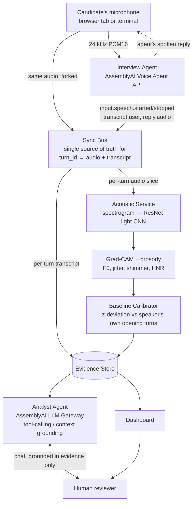

# Vocal Stress Co-Pilot

A voice AI agent for structured interviews, built on the AssemblyAI Voice Agent API and
LLM Gateway — **"Build Voice AI Agents on AssemblyAI"** (lablab.ai × AssemblyAI,
Sep 1–30 2026).

**It is not a lie detector.** No component of this system outputs a determination of
truthfulness — see [What this is / is not](#what-this-is-and-is-not) below before
anything else. That constraint is enforced in code, not just in this paragraph.

---

## Contents

- [What this is (and is not)](#what-this-is-and-is-not)
- [Who this is for](#who-this-is-for)
- [Why the AssemblyAI integration is deep, not decorative](#why-the-assemblyai-integration-is-deep-not-decorative)
- [How it works](#how-it-works)
- [Quick look, no setup](#quick-look-no-setup)
- [Local setup](#local-setup)
- [Running it](#running-it)
- [Testing](#testing)
- [Real results, honestly reported](#real-results-honestly-reported)
- [Project structure](#project-structure)
- [Data and licensing](#data-and-licensing)
- [Known limitations](#known-limitations)
- [Further reading](#further-reading)

---

## What this is (and is not)

**It is:** a real-time voice agent that conducts a structured interview while a parallel
acoustic pipeline measures *vocal arousal deviation* per answer — relative to that same
speaker's own opening turns, never to a population average — and a second agent explains
those measurements conversationally to a human reviewer, grounded strictly in that
session's own evidence.

**It is not:** a lie detector. Voice-based deception detection is scientifically
contested, and overclaiming it would be both dishonest and a scoring liability. Every
user-facing string — prompts, UI copy, the evidence schema's own `disclaimer` field —
uses the vocabulary of *arousal*, *deviation from baseline*, and *confidence*. Never
*lying*, *guilty*, *deceptive*, or *truthful*.

This is a structural guarantee, not a style choice:
[`test_to_evidence_dict_never_uses_deception_vocabulary`](tests/unit/test_entities.py)
fails the build if that vocabulary ever leaks in, and the Interview Agent conducting the
conversation is **architecturally blind** to every stress score the system computes — see
[ADR-002](ADR.md#adr-002). If a feature idea needs the interviewer to react to a live
score, it's the wrong feature; that gap is intentional, not an oversight.

## Who this is for

**Company interviewers and HR managers who want to standardize and automate parts of the
structured-interview process — specifically, giving candidates feedback that is
consistent and explainable rather than a private, unarticulated gut feeling.**

The status quo this replaces isn't a lie-detection process; it's the much more mundane
reality that interviewer feedback today is inconsistent between interviewers, rarely
written down in a form a candidate could actually see, and hard to defend if a candidate
asks *why* they didn't move forward. "The candidate seemed a bit off on the compensation
question" is a real thing interviewers say to each other and almost never something a
candidate hears back in a useful form.

This system turns that into something structured: a per-answer vocal-arousal signal,
computed relative to *that candidate's own* baseline (not a population norm), with a
concrete acoustic explanation attached (which frequency band the model attended to, which
prosodic features deviated and by how much) — and an Analyst Agent a reviewer can
interrogate about any turn before deciding what, if anything, to say to the candidate.

**This is a feedback and process-standardization tool, not a hiring-decision tool** — and
that's a deliberate product choice, not a hedge. An automated system inferring emotion to
make or influence a decision *about* a candidate sits in genuinely fraught legal and
ethical territory (the EU AI Act's restrictions on emotion recognition in workplace
contexts are the sharpest example); a system that gives a candidate a more legible,
explainable version of feedback an interviewer would otherwise give informally is a
different, much more defensible category. Every architectural choice in this repo —
the Interview Agent's blindness to scores, the ban on deception vocabulary, the Analyst
Agent's refusal to answer past what the evidence supports — exists in service of staying
in that category on purpose.

**What still needs to be built for this audience specifically** (tracked honestly, not
hidden): there is no candidate-facing version of this feedback yet — today's dashboard
and Analyst Agent are reviewer-facing only. A "formalized explanation" a candidate
actually receives is the natural next surface, and isn't built yet.

## Why the AssemblyAI integration is deep, not decorative

Both of AssemblyAI's real-time products are used for what they're actually for, not as a
thin pass-through:

- **Voice Agent API** runs the entire candidate conversation — speech-to-text, LLM
  routing, turn-taking/VAD, and voice output — through one connection
  (`src/voicestress/infrastructure/agents/voice_agent_client.py`). This isn't a
  quickstart-level integration: getting a real, natural two-way voice conversation
  working surfaced a series of protocol behaviors that don't match a first read of the
  docs, each found by actually running the thing and fixed with a regression test
  (full list: [ADR.md Appendix A](ADR.md#appendix-a)) —
  - the session-config field is `system_prompt`, not `instructions` (the server rejects
    the latter outright);
  - this account's connection emits `session.updated`, never the documented
    `session.ready`, with the session id nested differently than either event's own
    top-level shape suggests;
  - the platform's real default turn-detection timing (`min_silence`/`max_silence`)
    differs from a first guess enough to fragment continuous speech into several turns;
  - the agent's synthesized reply — `reply.started`/`reply.audio`/`reply.done` — is
    documented but easy to miss wiring entirely; this project shipped without it for a
    while, meaning candidates could be heard but never heard back, before that gap was
    found and closed.

  **JSON-Schema tool-calling is live**, not just configured: the Interview Agent carries
  exactly one tool, `flag_technical_issue` (a candidate reporting an audio problem —
  echo, can't hear, cutting out — logged for whoever reviews the session, and nothing
  else). Confirmed with a real `tool.call` event returned on the first live attempt,
  then verified end to end through the actual production code path: a live session
  driven to trigger the tool produced a saved session file containing exactly the
  flagged text (`ADR-044`). One tool, deliberately — the schema itself has no field
  that could carry a score even if someone tried, and a structural test scans it for
  exactly that (`test_flag_technical_issue_schema_names_nothing_analytical`).
- **LLM Gateway** powers the Analyst Agent with JSON-Schema tool-calling where the
  account's available model supports it, and falls back to a context-grounding mode
  (evidence pre-rendered into the system prompt) where it doesn't — decided at runtime
  by testing what the account can actually reach, not by reading the model roster and
  assuming (`ADR-030`). That's not a one-time check: re-probed against a live 34-model
  roster (`GET /v1/models`, up from the 4 originally guessed) on 2026-09-06, tool-calling
  specifically, and the result held — every model either isn't reachable on this account
  or doesn't support tools (`ADR-024`, `ADR-044`). The Voice Agent API's tool-calling,
  above, is a genuinely separate entitlement and isn't affected by this at all.

  **A related idea was deliberately not built**: moving the Analyst Agent onto a second
  Voice Agent connection, now that tool-calling is confirmed there. Re-reading
  AssemblyAI's own documentation first (`ADR-045`) surfaced the reason not to —
  `reply.audio` streams incrementally as the LLM generates ("you don't wait for the full
  reply to start playing," per AssemblyAI's own docs), with no documented point between
  text generation and audio playback where a caller can review content first. This
  project's vocabulary guard depends on exactly that kind of point existing; moving the
  Analyst Agent to voice would have meant either giving up the guard or shipping a
  feature with a known, undocumented gap in it. Neither was acceptable, so the idea was
  shelved with the reason on record rather than pursued anyway.

  Every Analyst Agent answer is grounded in that session's own evidence only, enforced by
  tests, not just by prompt wording.

The result: a live, bidirectional voice conversation where the candidate is asked
questions, actually hears the agent's spoken replies, and never once has that
conversation's tone or pacing altered by the acoustic analysis running silently
alongside it — verified by a test that inspects `VoiceAgentSession`'s entire public
surface for exactly that leak (`tests/unit/test_voice_agent_client.py`).

## How it works



**No arrow runs from the Evidence Store back into the Interview Agent.** That's the
whole point — see [ARCHITECTURE.md §2](ARCHITECTURE.md) for why.

Two front ends onto the same pipeline:

| Surface | What it does | Needs |
|---|---|---|
| **Live capture** (`capture.html`, or `scripts/run_interview.py`) | Candidate speaks; the Interview Agent replies in voice; each turn is scored as it lands | A real `ASSEMBLYAI_API_KEY` and a microphone |
| **Dashboard** (`index.html`) | Review any saved session: waveform, pitch contour, per-turn Grad-CAM, and a chat with the Analyst Agent | Nothing extra to *browse* past sessions; a key only to *ask* the Analyst Agent |

## Quick look, no setup

The repo ships one synthetic demo session (`demo_session_001`, [see license note
below](#data-and-licensing)) specifically so the dashboard isn't empty on a fresh clone.
After [installing dependencies](#local-setup):

```bash
python -m uvicorn web.backend:app --reload
```

Open **http://localhost:8000**, click `demo_session_001` in the sidebar. You can inspect
every turn, its Grad-CAM heatmap, and its prosody breakdown with **no API key at all** —
only the Analyst Agent chat panel needs one (it fails that one request with a clear 503,
not a crash, if unconfigured).

## Local setup

**Requirements:** Python 3.12 (developed and tested on 3.12.10; 3.11+ should work per
`pyproject.toml`), a C++-capable environment for TensorFlow's wheel (standard on
Windows/macOS/Linux — nothing extra to install), and, for the live agent only, a working
microphone.

```bash
git clone <this-repo>
cd AssemblyAi

python -m venv .venv
.venv\Scripts\activate        # Windows
# source .venv/bin/activate   # macOS/Linux

pip install -r requirements.txt
pip install -e .               # makes `voicestress` importable everywhere (src/ layout)

copy .env.example .env         # Windows
# cp .env.example .env         # macOS/Linux
```

Edit `.env` and set:

```
ASSEMBLYAI_API_KEY=<your key>
```

Get a key at [assemblyai.com](https://www.assemblyai.com/) — the free tier is enough to
run everything here, including the live agent, though its request ceiling is low (a
built-in `429` handler on the chat endpoint explains this in-app if you hit it, rather
than showing a raw error). The other three `.env.example` variables (Voice Agent /
Streaming / LLM Gateway URLs) already default to the verified real endpoints
(ARCHITECTURE.md §5) — leave them unless you have a reason to override.

`artifacts/models/arousal_resnet_light.keras` — the trained arousal classifier — is
**not in the repo** (gitignored per [ADR-016](ADR.md), since it's derived from licensed
training audio). You have two options:

1. **Train it yourself** (needs the datasets — see [Data and licensing](#data-and-licensing)):
   ```bash
   python scripts/build_features.py --corpus ravdess
   python scripts/build_features.py --corpus mustard
   python scripts/train_arousal_model.py
   ```
   `build_features.py`/`build_demo_session.py`/`train_arousal_model.py` default to
   treating the datasets as siblings of this repo (`../databaseAudio`, `../sarcasmoVoz`)
   — set `VOICESTRESS_HACKATHON_ROOT` to a different parent directory if yours live
   elsewhere. `train_arousal_model.py` runs the full A/B
   (random-init vs. warm-started) 5-fold CV, picks the winner, evaluates it cross-corpus,
   and writes `artifacts/models/arousal_resnet_light.keras` +
   `artifacts/metrics/latest.json`. Takes a few minutes on CPU.

2. **Use a checkpoint someone hands you.** Drop it at exactly
   `artifacts/models/arousal_resnet_light.keras` and everything else works unmodified.

Without a model checkpoint, the **dashboard still works** (it only reads already-saved
sessions) but **live capture will not** — both `run_interview.py` and `capture.html`
load the classifier at session start and fail clearly, not silently, if it's missing.

## Running it

```bash
# Dashboard — review saved sessions, chat with the Analyst Agent
python -m uvicorn web.backend:app --reload
# → http://localhost:8000
```

Keep `--reload`. Without it, uvicorn holds imported Python modules in memory across
requests, so a backend edit keeps silently running the *old* code — a real, previously
hard-to-diagnose bug (ADR.md Appendix A, row 32). Static JS/CSS is separately protected
by a `no-store` header; only the Python side needs `--reload`.

```bash
# Live interview, in a browser — no local mic drivers needed
# (with the dashboard already running above)
# → http://localhost:8000/capture.html
```

```bash
# Live interview, in a terminal — needs a real local microphone
python scripts/run_interview.py
```

Both live paths need `ASSEMBLYAI_API_KEY` set and the model checkpoint in place. The
first three turns of every session are used to calibrate that speaker's own baseline —
answer normally; scoring (relative to *that* baseline) starts from turn four.

**If port 8000 won't load or hangs indefinitely:** you likely have two server processes
bound to it at once (easy to do by starting a second `uvicorn --reload` without stopping
the first — Windows doesn't always refuse the second bind). Check with:

```bash
netstat -ano | findstr :8000        # Windows
# lsof -i :8000                     # macOS/Linux
```

More than one process `LISTENING` on the same port is the signal — stop all of them and
start exactly one.

```bash
# One-time sanity check that your API key actually authenticates
python scripts/check_live_connection.py
```

```bash
# Build a fresh offline demo session from real RAVDESS audio (no API key needed)
python scripts/build_demo_session.py
```

## Testing

```bash
python -m pytest tests/ -m "not quality_gate"   # unit + integration, ~15s, no training needed
python -m pytest tests/quality_gates/           # reads artifacts/metrics/latest.json
python -m pytest tests/                         # everything, ~20s
```

287 tests as of this writing — all passing, no network, no live API key, no real
microphone required (the handful of things that genuinely can't be tested that way are
named explicitly in [ARCHITECTURE.md §7b](ARCHITECTURE.md) and in code comments, not
silently skipped). Every bug that ever reached running code has a regression test and a
row in [ADR.md's Appendix A](ADR.md#appendix-a) — 42 rows, at last count.

## Real results, honestly reported

| Metric | Value |
|---|---|
| RAVDESS in-corpus OOF accuracy (5-fold CV, warm-started) | 0.841 |
| **Cross-corpus accuracy** (trained on RAVDESS, evaluated on MUStARD++ `Arousal`, never trained on) | **0.597** |
| Cross-corpus majority-class baseline (this eval set) | 0.504 |
| Cross-corpus F1 | 0.669 |

**The cross-corpus number is the one that matters, and it's modest: +9.3 points over
guessing the majority class.** In-corpus accuracy looks better (0.841) precisely because
it's the easier, less honest number — same speech style, same recording conditions as
training. Report the cross-corpus figure to anyone asking "how good is the model," full
stop; the quality gates in `tests/quality_gates/` fail the build if either number drops
below a threshold anchored to its own eval set's baseline, not an arbitrary target.

This is *why* the product never uses a fixed threshold: every turn is scored relative to
that speaker's own first few answers, not against a population norm the model is only
weakly calibrated to in the first place. The weak cross-corpus number is the empirical
argument for that design, not a footnote to hide.

## Project structure

```
├── src/voicestress/
│   ├── domain/            # entities, value objects — zero framework imports
│   ├── application/       # use cases: LiveInterviewRunner, EvidenceService, SyncBus,
│   │                       # BaselineCalibrator, TranscriptPairer, vocabulary guard
│   └── infrastructure/
│       ├── audio/          # spectrogram extraction, Praat prosody, resampling
│       ├── models/         # ResNet-light CNN, Grad-CAM, the trained classifier adapter
│       └── agents/         # Voice Agent + LLM Gateway clients (Transport-injected,
│                            # fully fake-tested — see tests/unit/test_voice_agent_client.py)
│
├── agents/prompts/
│   ├── interviewer.md      # Interview Agent — blind to scores by construction
│   └── analyst.md          # Analyst Agent — vocabulary + grounding rules
│
├── scripts/                # composition roots: build_features, train_arousal_model,
│                            # build_demo_session, run_interview, check_live_connection
│
├── web/
│   ├── backend.py          # FastAPI: dashboard API + /ws/interview route
│   ├── live_capture.py     # browser capture composition root
│   └── static/             # index.html/app.js (dashboard), capture.html/capture.js/
│                            # capture-worklet.js (live capture) — no build step, no npm
│
├── tests/                  # unit / integration / quality_gates
├── ARCHITECTURE.md         # the what — system design, data flow, real results
├── ADR.md                  # the why — every decision, its cost, and the full bug log
├── SKILLS.md               # the how — hard rules, settled facts, running instructions
└── CLAUDE.md               # guardrail: keeps AI-assisted work honoring the above
```

## Data and licensing

This repo's **code** is open to read and reuse. The **data it was trained on is not
included**, and none of it should ever be committed here:

- **RAVDESS** (speech) — CC BY-NC-SA 4.0. Non-commercial, share-alike, attribution
  required. Get it from [Zenodo](https://zenodo.org/record/1188976).
- **MUStARD++** — its own research-use terms; used here only as an unseen cross-corpus
  evaluation set, never trained on.

`.gitignore` excludes raw audio (`*.wav`/`*.mp3`/`*.mp4`), the dataset directories
themselves, derived spectrograms, and the trained model checkpoint. **One deliberate
exception:** `demo_session_001` (a ~170 KB JSON + 14 small PNGs) ships in this repo so a
fresh clone has something to look at — it's built from RAVDESS Actor 01's real audio
paired with a **scripted, non-verbatim** transcript for illustration
(`scripts/build_demo_session.py`), used here non-commercially with attribution, and is
clearly labeled `"is_synthetic_demo": true` everywhere the dashboard shows it. Every
*other* session file is excluded — a live interview may contain a real person's actual
speech and name, and that never belongs in version control regardless of who ran it.

## Known limitations

Stated plainly, because the alternative is a judge finding them first:

- **The hosted URL's first request after a quiet period can be slow, or fail once.**
  The free hosting tier spins the instance down after inactivity; the first hit after
  that can take ~30-60s to wake up, and — confirmed live, ADR-048 — a WebSocket
  connection arriving during that exact window can fail outright with no error message
  rather than waiting for the instance the way a normal HTTP request does. If the
  hosted dashboard seems unresponsive, reload once and wait a few seconds.
- **Live capture is not enabled on the hosted URL, on purpose.** The public deployment
  has no `ASSEMBLYAI_API_KEY` configured — see [Why the AssemblyAI integration is
  deep](#why-the-assemblyai-integration-is-deep-not-decorative) and ADR-045/047/048 for
  why. It runs fully locally (see [Running it](#running-it)); the demo video shows it.

- **Cross-corpus accuracy is 0.597** — real signal, not a strong classifier. See
  [above](#real-results-honestly-reported) for why the product design doesn't depend on
  it being stronger.
- **Live capture's full real-mic-to-real-agent loop is confirmed working end-to-end in
  a real browser session** (mic in, the candidate's own voice, the agent's spoken reply
  heard back) — but by one developer, in a handful of sessions, not yet by an
  independent user or across the range of browsers/microphones a real deployment would
  see. See [ARCHITECTURE.md §7b](ARCHITECTURE.md) for exactly what that first real
  session did and didn't confirm.
- **The exact key AssemblyAI uses for the agent's synthesized reply audio was never
  documented and had to be guessed** (`ADR-040`/`ADR-043`) — the code tries several
  plausible field names and degrades safely (bounded diagnostics, never a raw dump) if
  none match, rather than assuming success.
- **No mobile layout.** The dashboard and capture page assume a wide viewport; nothing
  currently degrades gracefully on a phone screen.
- **Free-tier rate limits are real.** The Analyst Agent chat surfaces a clear message on
  HTTP 429 rather than a raw error, but running many chat questions or several live
  sessions back to back on a free API key will hit it.
- **Dataset paths are one environment variable, not CLI arguments** — set
  `VOICESTRESS_HACKATHON_ROOT` if your copy of the datasets isn't a sibling directory
  of this repo (the default assumption). An earlier version of this hardcoded a literal
  local path here instead; caught during a pre-publish audit before the first commit
  went to GitHub (Appendix A, row 45).

## Further reading

- **[ARCHITECTURE.md](ARCHITECTURE.md)** — full system design, data flow, and the honest
  record of what's confirmed live vs. still assumed.
- **[ADR.md](ADR.md)** — every architectural decision made on this project, its
  trade-offs, and a 47-row catalogue of every bug that ever reached running code, paired
  with the test that now guards it.
- **[SKILLS.md](SKILLS.md)** — hard rules, settled facts, and the day-to-day commands
  for working on this codebase.
